# 🍳 Co-cook! - AI Cooking Copilot


<br>

## [🔗 Co-cook! 배포 사이트](http://j8b302.p.ssafy.io/)

<br>
<hr/>
<br>

## 🎬 UCC

### 요리를 손쉽게, Co-cook!

[](https://youtu.be/cNF4W59XCDw?t=0s)

<br>
<hr/>
<br>

## 📄 목차

### 1. [개요](#-개요)

### 2. [주요 기능](#-주요기능)

### 3. [주요 기술](#-주요-기술)

### 4. [프로젝트 구조](#-프로젝트-파일-구조)

### 5. [협업 환경](#-협업-환경)

### 6. [팀원 역할 분배](#-팀원-역할-분배)

### 7. [프로젝트 산출물](#-프로젝트-산출물)

### 8. [프로젝트 결과물](#-프로젝트-결과물)

### 9. [Co-cook! 서비스 화면](#-co-cook-서비스-화면)

<br>
<hr/>
<br>

## ✔ 개요

<br>

### 👨‍🍳 프로젝트 진행 기간

2023.02.20(월) ~ 2023.04.07(금) (7주간 진행) SSAFY 8기 2학기 공통프로젝트 - 음성 AI

<br>

### 🍴 Co-cook! - 배경

주방에서 요리를 할 때 지저분한 손으로 스마트폰을 만지기 불편한 상황이나, 손이 젖은 상태에서 레시피를 확인하거나 타이머를 설정하는 것이 어려운 경우를 겪어본 적 있으신가요? 이러한 문제를 해결하기 위해 Co-cook!을 개발했습니다.

<br>

### 🍱 Co-cook! - 개요

**음성인식 AI로 요리를 손쉽게**

Co-cook!은 음성인식 AI 기반의 레시피 모바일 애플리케이션입니다. Co-cook!은 화면 음성 제어, 재료기반 레시피 추천, 사진기반 레시피 추천, 지능형 추천 알고리즘 서비스를 제공합니다.

<br>
<hr/>
<br>

## ✔ 주요기능

<br>

- 화면 음성 제어

  - 음식을 만드는 동안 손이 더러워지거나 젖은 상태에서도
  - "Hey, 코쿡!"을 불러주세요.
  - '다음', '이전', '다시', '타이머' 명령어를 통해
  - 화면 이동, TTS 재생, 타이머 설정이 가능합니다.

<br>

- 재료기반 레시피 추천

  - 냉장고에 있는 재료! 있는 그대로 말만 하세요.
  - '당근', '양파', '고구마', '~~쇠창살~~'
  - 재료인지 저희가 판단하고 보여드려요.
  - 그리고 만들 수 있는 요리들도 알려드립니다.

<br>

- 사진기반 레시피 추천

  - 레시피가 궁금한 요리가 눈 앞에 있나요?
  - 사진 한장이면 됩니다.
  - 사진을 찍거나 앨범에서 선택하고 기다려 주세요.
  - 그려면 어떤 요리인지, 레시피를 알려드립니다.

<br>

- 지능형 검색 알고리즘

  - 무슨 요리였는지 잘 기억나지 않아도
  - 일단 검색해보세요.
  - 유사한 레시피들을 저희가 알아서 찾아드립니다.

<br>
<hr/>
<br>

## ✔ 주요 기술

<br>

### BackEnd Stack


<br>

### FrontEnd Stack


<br>
<hr/>
<br>

## ✔ 프로젝트 파일 구조

<br>

### Mobile

```
📦co_cook
┣ 📂android
┣ 📂assets
┃ ┣ 📂audios
┃ ┣ 📂fonts
┃ ┣ 📂images
┃ ┃ ┣ 📂app_icon
┃ ┃ ┣ 📂background
┃ ┃ ┣ 📂button_img
┃ ┃ ┣ 📂etc
┃ ┃ ┗ 📂logo
┃ ┣ 📂keywords
┃ ┗ 📂models
┣ 📂ios
┗ 📂lib
┣ 📂providers
┣ 📂screens
┃ ┣ 📂camera_screen
┃ ┃ ┗ 📂widgets
┃ ┣ 📂cook_screen
┃ ┃ ┗ 📂widgets
┃ ┣ 📂favorite_screen
┃ ┣ 📂home_screen
┃ ┃ ┗ 📂widgets
┃ ┣ 📂image_result_screen
┃ ┣ 📂ingredient_list_screen
┃ ┣ 📂list_screen
┃ ┣ 📂login_screen
┃ ┣ 📂main_screen
┃ ┣ 📂my_review_screen
┃ ┃ ┗ 📂widgets
┃ ┣ 📂photo_card_screen
┃ ┃ ┗ 📂widgets
┃ ┣ 📂recipe_detail_screen
┃ ┃ ┗ 📂widgets
┃ ┣ 📂review_screen
┃ ┣ 📂search_screen
┃ ┃ ┗ 📂widgets
┃ ┣ 📂signup_screen
┃ ┣ 📂splash_screen
┃ ┣ 📂user_screen
┃ ┗ 📂voice_search_screen
┣ 📂services
┣ 📂styles
┣ 📂utils
┣ 📂widgets
┃ ┣ 📂bottom_nav_bar
┃ ┣ 📂button
┃ ┣ 📂card
┃ ┣ 📂comment
┃ ┣ 📂favorite_direct
┃ ┣ 📂nickname_change
┃ ┣ 📂save_complete
┃ ┣ 📂shimmer
┃ ┣ 📂sliding_up_panel
┃ ┣ 📂sound_meter
┃ ┗ 📂text_field
┗ 📜main.dart
```

<br>

### Front

```
📦co-cook
┣ 📂public
┃ ┗ 📂assets
┣ 📂src
┃ ┣ 📂assets
┃ ┃ ┣ 📂image
┃ ┃ ┣ 📂logo
┃ ┃ ┗ 📂videos
┃ ┣ 📂components
┃ ┃ ┣ 📂common
┃ ┃ ┣ 📂DownloadPage
┃ ┃ ┗ 📂MainPage
┃ ┣ 📂pages
┃ ┣ 📂styles
┃ ┃ ┣ 📂fonts
┃ ┃ ┃ ┗ 📂pretendard
┃ ┃ ┃ ┃ ┣ 📂woff
┃ ┃ ┃ ┃ ┣ 📂woff-subset
┃ ┃ ┃ ┃ ┣ 📂woff2
┃ ┃ ┃ ┃ ┣ 📂woff2-subset
┃ ┃ ┣ 📜reset.css
┃ ┃ ┣ 📜theme.js
┃ ┃ ┗ 📜theme.ts
┃ ┣ 📜App.js
┃ ┣ 📜App.tsx
┃ ┣ 📜main.js
┃ ┣ 📜main.tsx
┃ ┗ 📜vite-env.d.ts
┣ 📜.gitignore
┣ 📜custom.d.ts
┣ 📜Dockerfile
┣ 📜index.html
┣ 📜nginx.conf
┣ 📜package-lock.json
┣ 📜package.json
┣ 📜tsconfig.json
┣ 📜tsconfig.node.json
┗ 📜vite.config.ts
```

<br>

### Back

```
📦backend
┣ 📂cocook
┃ ┗ 📂src
┃ ┗ 📂main
┃ ┗ 📂resources
┣ 📂gradle
┃ ┗ 📂wrapper
┣ 📂src
┃ ┣ 📂main
┃ ┃ ┣ 📂java
┃ ┃ ┃ ┗ 📂com
┃ ┃ ┃ ┃ ┗ 📂cocook
┃ ┃ ┃ ┃ ┃ ┣ 📂auth
┃ ┃ ┃ ┃ ┃ ┣ 📂config
┃ ┃ ┃ ┃ ┃ ┣ 📂controller
┃ ┃ ┃ ┃ ┃ ┣ 📂dto
┃ ┃ ┃ ┃ ┃ ┃ ┣ 📂comment
┃ ┃ ┃ ┃ ┃ ┃ ┣ 📂db
┃ ┃ ┃ ┃ ┃ ┃ ┣ 📂favorite
┃ ┃ ┃ ┃ ┃ ┃ ┣ 📂home
┃ ┃ ┃ ┃ ┃ ┃ ┣ 📂list
┃ ┃ ┃ ┃ ┃ ┃ ┣ 📂recipe
┃ ┃ ┃ ┃ ┃ ┃ ┣ 📂review
┃ ┃ ┃ ┃ ┃ ┃ ┣ 📂user
┃ ┃ ┃ ┃ ┃ ┣ 📂entity
┃ ┃ ┃ ┃ ┃ ┣ 📂exception
┃ ┃ ┃ ┃ ┃ ┣ 📂filter
┃ ┃ ┃ ┃ ┃ ┣ 📂repository
┃ ┃ ┃ ┃ ┃ ┣ 📂service
┃ ┃ ┃ ┃ ┃ ┣ 📂util
┃ ┃ ┃ ┃ ┃ ┗ 📜CocookApplication.java
┃ ┃ ┗ 📂resources
┃ ┗ 📂test
┃ ┗ 📂java
┃ ┗ 📂com
┃ ┗ 📂cocook
┣ 📜.gitignore
┣ 📜build.gradle
┣ 📜Dockerfile
┣ 📜gradlew
┣ 📜gradlew.bat
┗ 📜settings.gradle
```

<br>

### AI

```
📦ai
┣ 📂uploaded_files
┣ 📂uploaded_files_dj
┣ 📂uploaded_files_hs
┣ 📜.gitignore
┣ 📜DenseNet201_0331.h5
┣ 📜Dockerfile
┣ 📜image_method.py
┣ 📜label_encoder.pkl
┣ 📜main.py
┣ 📜model.h5
┣ 📜requirements.txt
┗ 📜voice_method.py
```

<br>
<hr/>
<br>

## ✔ 협업 환경

<br>

### 협업 툴

<br>


<br>

### 협업 내용

<br>

- Gitlab

  - 코드의 버전을 관리

  - master, develop, feature로 기능 단위로 브랜치 관리

  - 상세 기능 구현 시, feature-기능(페이지)로 세부 브랜치 관리

  - 정해진 commit style에 맞춰 커밋 기록 관리

- JIRA

  - 매주 목표량을 설정하여 Sprint 진행

  - 업무의 할당량을 정하여 Story Point를 설정하고, In-Progress -> Done 순으로 작업

  - 아침회의 진행, 전날 목표 달성량과 당일 할 업무 브리핑

  - 오류나 협업이 필요한 일이라면 빠른 mattermost를 통해 관련 내용을 전달하고 상의

- Notion

  - 회의가 있을 때마다 회의록을 기록하여 보관

  - 에러 사항에 대해 기록하고 해결법 공유

  - 컨벤션 정리

  - 와이어프레임, 목업, 기능명세서, ERD, API 리스트 등 산출물 실시간 공유

- Figma

  - 피그마 디자인을 이용한 와이어 프레임 설계

  - 피그마 디자인을 이용한 디자인 및 목업 설계

  - 발표 자료 제작과 중간 결과물 실시간 공유

<br>
<hr/>
<br>

## ✔ 팀원 역할 분배

<br>

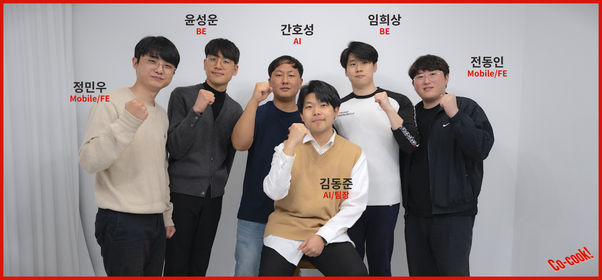

Mobile/FE

- 정민우
- 전동인

BE

- 윤성운
- 임희상

AI

- 김동준
- 정호성

<br>
<hr/>
<br>

## ✔ 프로젝트 산출물

- [기능명세서](https://docs.google.com/spreadsheets/d/1zkbUUTM7u95iIkUOWzOjrRlMH-YVcKjaYatXHJFF1fw/edit#gid=2066790816)

- [와이어프레임](https://www.figma.com/file/u83HRrNeDlQm7oqFonlJan/Cocook?node-id=1%3A2&t=o8p3qPAzLGwNXfh6-1)

- [목업](https://www.figma.com/file/u83HRrNeDlQm7oqFonlJan/Cocook?node-id=0%3A1&t=o8p3qPAzLGwNXfh6-1)

- [ERD](https://www.notion.so/ERD-3d0f92490506417ca2d4051ca377195f?pvs=4)

- [API](https://www.notion.so/API-1374ebaee119440a9b100d800eea357a?pvs=4)

<br>

## ✔ 프로젝트 결과물

- [포팅메뉴얼](https://www.notion.so/acf38d38dd7a4663a81f18547a59f361?pvs=4)

- [발표자료](https://www.figma.com/file/u83HRrNeDlQm7oqFonlJan/Cocook?node-id=1216%3A6448&t=o8p3qPAzLGwNXfh6-1)

<br>
<hr/>
<br>

## 📱 Co-cook! 서비스 화면

<br>

### 로그인 / 회원가입

- 구글 로그인으로 서비스를 이용할 수 있습니다.
- 이미 존재하는 회원은 회원가입 화면 없이 서비스로 바로 이동합니다.
- 처음 방문한 회원은 닉네임 기입을 통한 회원가입 후 서비스로 이동합니다.

<div style="display: flex; height: 400px;">
  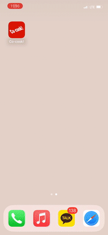</img>
</div>

<br>
<hr/>
<br>

### 홈 화면

- 현재 시간에 맞는 요리를 추천합니다.
- 재료 검색 및 레시피 사진 검색 페이지로 이동할 수 있습니다.
- 테마 & 카테고리별 레시피 목록을 확인할 수 있습니다.
- 추가적인 레시피를 제공받습니다.
- 원하는 레시피는 찜을 할 수 있습니다.

<div style="display: flex; height: 400px;">
  </img>
  </img>
  </img>
</div>

<br>
<hr/>
<br>

### 레시피 상세 화면

- 레시피에 관한 기본 정보를 제공받습니다.
- 레시피 단계별로 사진과 설명을 볼 수 있습니다.
- 해당 레시피로 요리를 완료한 유저의 한줄평을 볼 수 있습니다.
- 내가 작성한 한줄평은 상단에 제공해 더욱 편리하게 조회할 수 있습니다.
- 한줄평에 좋아요를 하거나 신고를 할 수 있고, 내가 작성한 한줄평인 경우 삭제할 수도 있습니다.

<div style="display: flex; height: 400px;">
  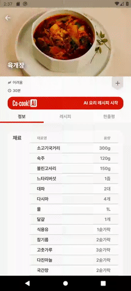</img>
  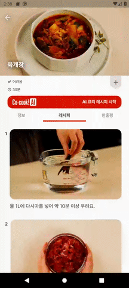</img>
  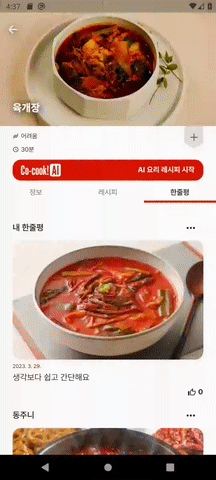</img>
</div>

<br>
<hr/>
<br>

### 레시피 조리 화면

- 음성만으로 조리 화면을 제어할 수 있습니다.
- 각 레시피에 맞는 이미지와 설명을 보면서 음성으로도 설명을 들을 수 있습니다.
- 시간을 재야 하는 경우 타이머 기능을 제공합니다.

</img>
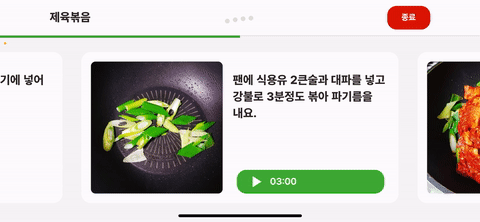</img>

<br>
<hr/>
<br>

### 레시피 종료 화면

- 레시피를 보며 직접 만든 요리를 사진과 함께 한줄평으로 남길 수 있습니다.
- 만들어진 포토 카드를 공유하거나 저장할 수 있습니다.

<div style="display: flex; height: 400px;">
  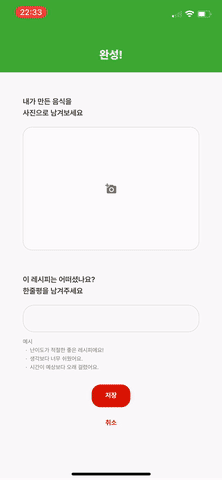</img>
  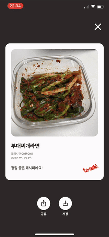</img>
</div>

<br>
<hr/>
<br>

### 냉털 화면

- 음성으로 재료를 추가해, 현재 보유한 재료에 맞는 레시피를 검색합니다.
- 재료를 토글로 추가하거나 제거함으로써 간편한 검색을 제공받을 수 있습니다.

<div style="display: flex; height: 400px;">
  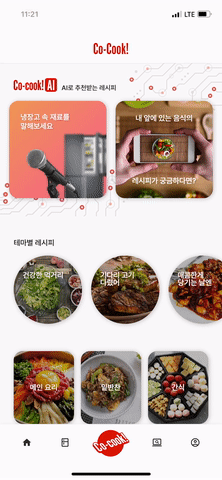</img>
  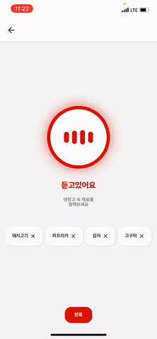</img>
</div>

<br>
<hr/>
<br>

### 검색 화면

- 현재 인기 검색어를 제공받습니다.
- 검색한 키워드와 관련된 다른 레시피도 추천받습니다.
- 실시간으로 음식을 찍거나 앨범에 있는 사진으로 해당 음식의 레시피를 제공받을 수 있습니다.

<div style="display: flex; height: 400px;">
  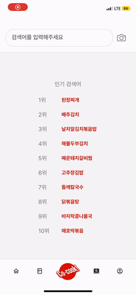</img>
  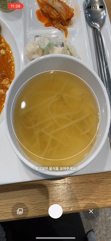</img>
</div>

<br>
<hr/>
<br>

### 테마 & 카테고리별 레시피 화면

- 현재 테마/카테고리에 해당하는 레시피 목록을 제공받습니다.
- 난이도와 조리시간으로 필터링해 원하는 조건에 맞는 레시피를 조회할 수 있습니다.

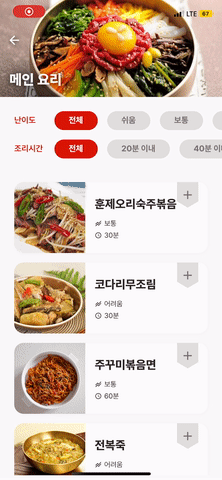</img>

<br>
<hr/>
<br>

### 내가 찜한 레시피

- 기존에 찜했던 레시피 목록을 제공합니다.
- 해당 레시피 상세 화면으로 이동할 수 있습니다.

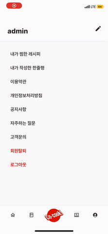</img>

<br>
<hr/>
<br>

### 내가 작성한 한줄평

- 작성한 한줄평 목록을 볼 수 있습니다.
- 작성했던 한줄평의 레시피 상세 화면으로 이동할 수 있습니다.
- 한줄평을 삭제할 수 있습니다.

</img>

<br>
<hr/>
<br>

## [🔗 Co-cook! 다운로드](http://j8b302.p.ssafy.io/install)

<br>


