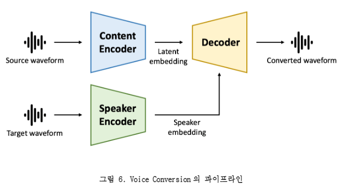

# SUB II

### VC 모델

- VC 모델 구현을 위해서는 입력된 음성들을 mel-spectrogram으로 변환하는 과정이 필요
- mel-spectrogram으로 변환하면 시간에 따라 달라지는 주파수 특성을 파악할 수 있음

### 분별 모델(Discriminative model) vs 생성 모델(Generative Model)

- 분별 모델
  - 입력 X가 있을 때 Y를 직접 추론하는 방법
  - 레이블링이 필요하기 때문에 지도학습에 해당
  - 일반적인 분별 모델의 알고리즘은 데이터들을 구분하는 경계(decision boundary)를 찾는 것이 목표
- 생성 모델
  - 분포
    - 정규 분포
      - 평균과 분산이라는 파라미터를 가지고 특정 수식으로 정의된 분포
      - 분포를 알고있으면 데이터 샘플링(생성) 할 수 있음
  - 샘플
    - 수식을 모르면 샘플링을 통해 랜덤 데이터를 생성하는 것은 불가능
- 생성 모델은 학습 데이터셋을 활용하여 분포에 대한 정해진 수식 대신 모델(ex. 인공 신경망)을 이용해 데이터셋의 분포를 근사 표현하고 샘플링 가능한 모델을 학습하는 것을 의미

### Variational Auto-encoder(VAE)

- 오토인코더(AE)는 라벨링 되지 않은 데이터를 저 차원의 특정코드로 압축했다 재구성하는 방식으로 학습되는 비지도 학습 방법이며, 인코더를 통해 추출된 정보는 잠재코드(latent code)라고 한다.
- 오토인코더(AE)는 입력과 출력의 차이 값을 손실함수로 이용해 모델을 학습한다. 즉, 원본 데이터와 재구성한 데이터의 차이를 최소화하는 방식으로 학습하며, 이 손실함수를 reconstruction loss라고 한다.
- VAE는 AE와 구조적으로 유사하나 잠재코드의 분포가 정규 분포를 따르도록 유도한 모델.
- VAE의 인코더는 랜덤 샘플링에 일반화가 가능하도록 구조화되어 있음

### Kullback-Leibler Divergence(KL divergence)

- KL divergence는 두 확률 분포의 차이를 수치화하는 데 사용하는 함수
- 두 확률 분포가 동일할수록 0에 가까운 값을 가짐
- KL divergence는 VAE에서 인코더를 학습 할 때, 인코더의 출력 분포가 표준정규분포와 비슷하게 유도 되도록 보조하는 역할

### Generative Adversarial Network(GAN)

- 샘플을 생성하는 문제를, 속고 속이는 게임인 min-max 게임의 형태로 접근
- 생성자와 구별자, 두 주체가 충돌하면서 발전이 이뤄지는 적대적 프로세스라는 점에 기인해 이름이 지어짐
- 경쟁을 통한 모델링
- 근본적인 한계
  - 안정성이 떨어져 학습이 어렵다
  - 학습시키려는 모형잉 실제 데이터들의 분포를 모두 커버하지 못하고 다양성을 잃어버리고 매번 실제 같은 영상 한 두 개만 반복 생성하는 현상인 모드 붕괴(mode collapsing)가 발생하기도 함
  - 최적점(optimal point)에 도달했다는 걸 판단하기 어렵다. 즉, 수렴 판별이 어려움

### Voice Conversion(VC) Model

- 두 종류의 음성을 입력으로 받아 한 음성의 컨텐트(content)를 다른 음성의 목소리로 변환하는 기술
- 스피커 인코더에서는 음성 특징들의 전역 평균을 통해 음색 정보 추출
- 컨텐트 인코더에서는 즉각적인 언어적인 정보를 추출
- 디코더에서 두 정보를 합쳐 새로운 음성을 생성

### 음성 데이터 전처리 과정 이해(Mel-spectrogram)

- VC 모델 구현을 위해서는 음성을 모델이 다룰 수 있는 데이터 형태인 mel-spectrogram으로 변환하는 과정이 필요
- 음성 데이터는 CNN, RNN 구조에 사용하기에 비효율적
- short time fourier transform(STFT)을 통해 spectrogram이라는 데이터 형태로 변환 후 사람의 청력 시스템을 모사한 mel-filter bank라는 필터를 통과시켜 mel-spectrogram을 생성
