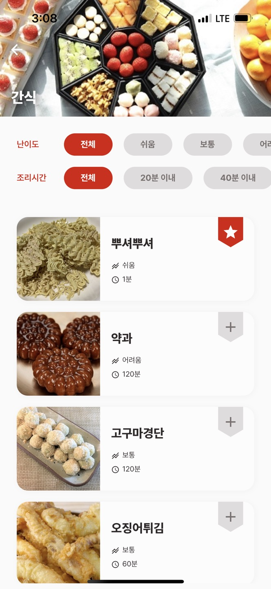
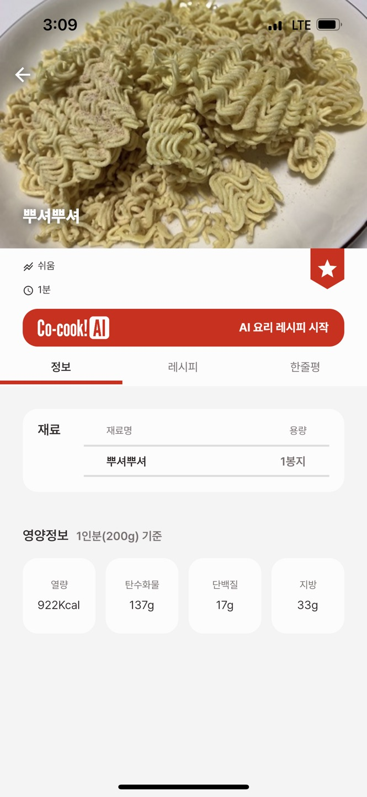
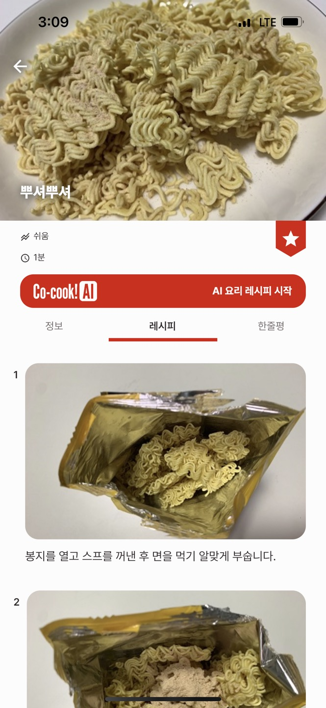
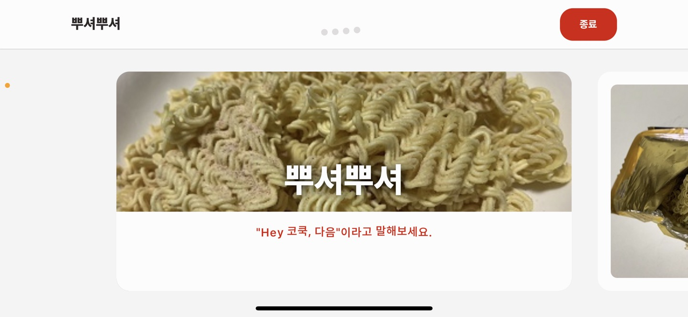

# 시연 시나리오

## 1. 메인 페이지

- 옆으로 넘기면서 추천 레시피를 보여준다.

## 2. 메인 AI 페이지

- 냉장고 속 재료를 말해보세요를 눌러 냉털 페이지로 이동한다.

## 3. 냉털

- 탭하여 시작 위 부분을 누른다.
- 음성 입력 준비 완료

- 돼지고기, 고추장, 두부, 마늘, 양파를 말한다.
- 완료 버튼을 누른다.

- 검색된 메뉴가 나온다.
- 두부, 고추장 등 위에 토글을 켰다 끄면서 바뀌는 화면을 보여준다.
- 즐겨찾기를 등록 및 삭제한다.

## 4. 레시피

- 메인페이지에서 여러 방식의 레시피 추천을 보여준다.

- 시연시나리오 용 뿌셔뿌셔를 누른다.

- 뿌셔뿌셔 정보를 보여준다.

)
- 뿌셔뿌셔 레시피를 보여준다.

- 뿌셔뿌셔 레시피로 조리를 시작한다.
- 음성만으로 페이지를 넘기고 타이머를 조절하며 종료한다.

- 요리가 완성된 리뷰를 남긴다.

